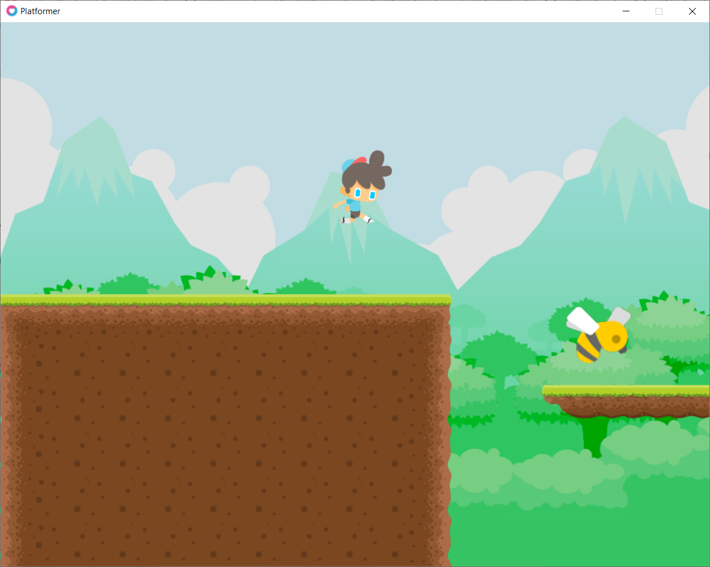
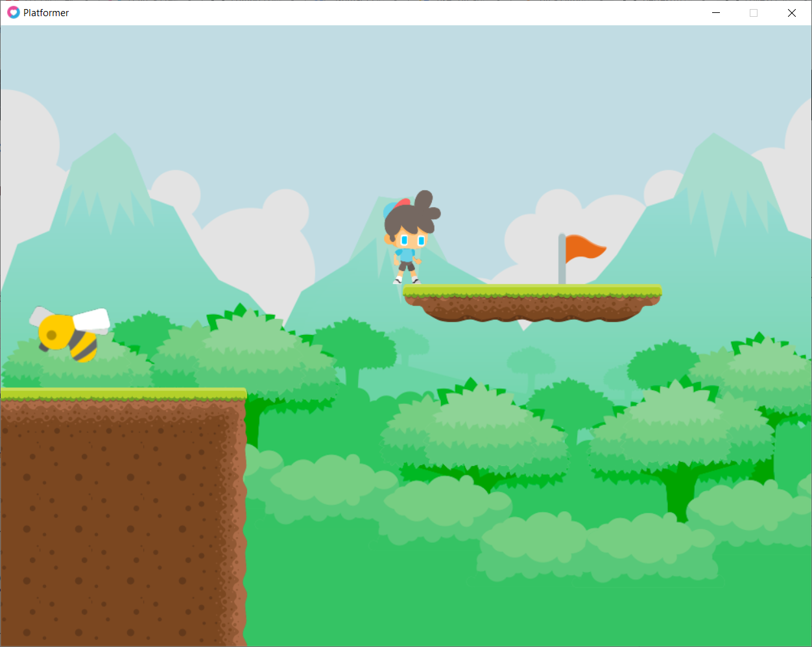
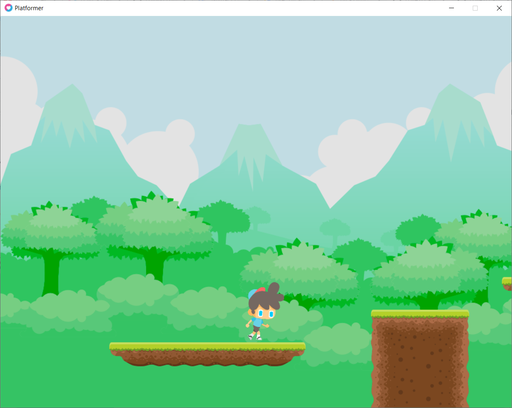
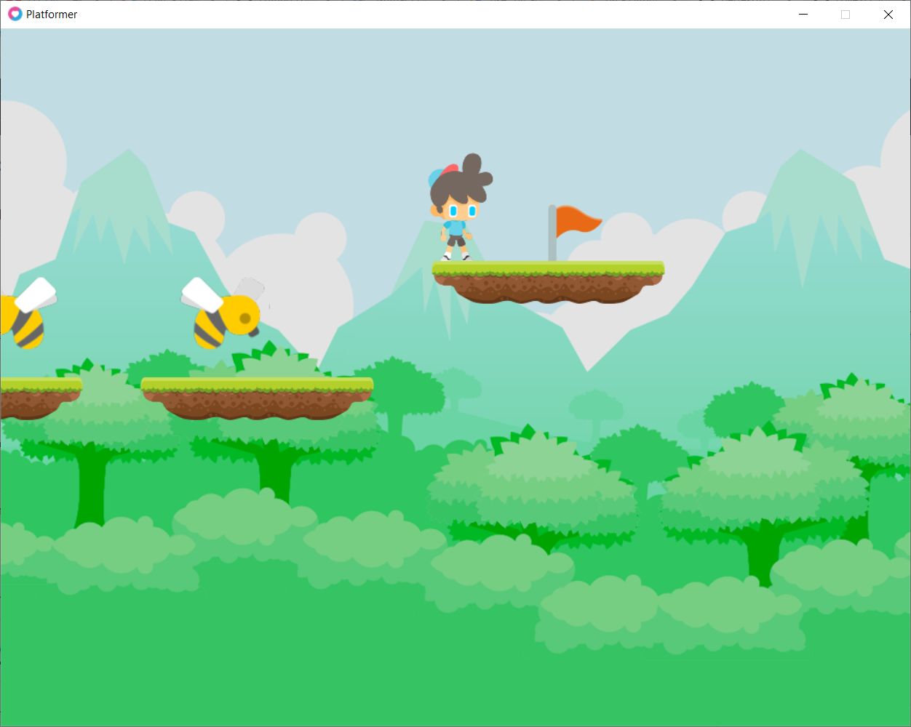

# Love2D_Platformer
 First game used LÖVE framework. Simple demo of platformer game. Include physical and sounds. Created with LÖVE 11.3. This project based on Udemy course: https://www.udemy.com/course/lua-love/, section: "Game #3: Platformer".

## All screenshots
 
 ### 1. Level 1 Start:
 

 ### 2. Level 1 End:
 

### 3. Level 2 Start:
 
 
 ### 4. Level 2 End:
 
